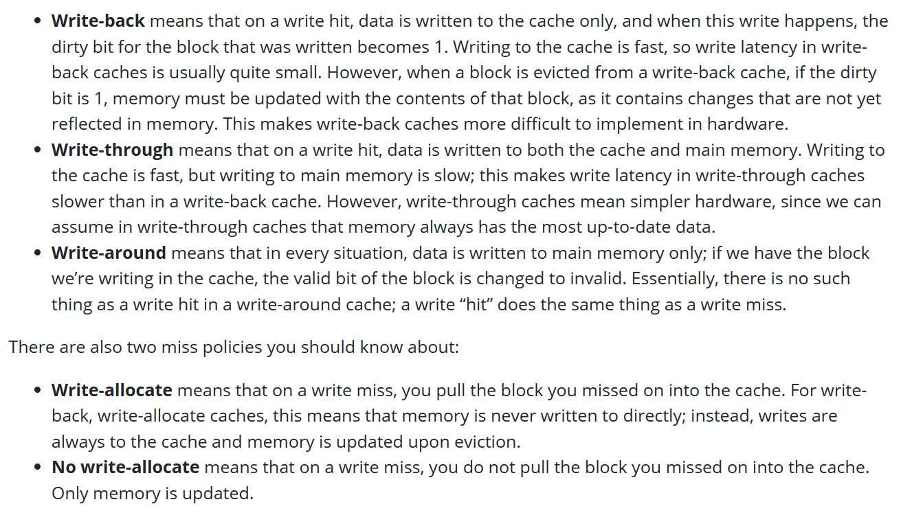

Summary
---
1. 加速大约 1 倍多, 因为 bottleneck 在内存, 加速没有想象的多
2. 这问让我收获颇丰, 对缓存的概念更加清晰了. 
    - 向内存中写元素时会发生 Cache Miss, 这时有两种应对策略
      - Write back and Write allocate
      - Write through and No Write allocate
    - 
    - 直写就是不管什么样都写两份，写回就是只写高速缓存，仅当页面被换出时写回 Memory。
    - Write-allocate: 当写页面丢失时，将内存拿到 Cache 中再写
    - No Write-allocate: 写的时候如果 Write Miss 则不拿到 Cache 中，而是直接向内存中写。只有读数据会被缓存
    - 显然，Write-back 配合 Write-allocate；Write-through 配合 No Write-allocate
    - 这时我们考虑对于内存来说, 如果每个 Result 我们都是直接向内存中写, 那将会是一场灾难, 所以内存一定采用的是 Write-allocate的方式
    - 所以我们要向 Result 写入, 就一定要先将其加载到缓存中, 这就需要那额外的一次内存操作
- 那能不能直接向缓存中写, 随后一次写到内存, 而不提前读入呢?
  - 毕竟我们知道要写的地址以及数据, 所以缓存表项是可以填充的
  - 然而没有这样的操作, 所以显然是不能的
  - 从存储结构上来说, 缓存必须是内存的子集, 其数据源于内存. 另一方面, 内存需要知道哪些页面正在被使用来决定能否共享.
