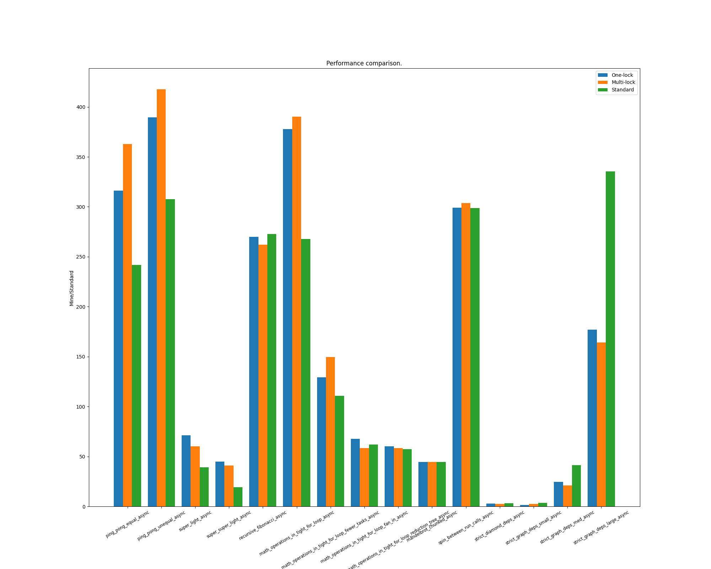

Summary
---
- Use mulitple condition variables, which is efficient.
  - At the beginning, use one thread to wait for one unfinished task.
  - But it will create too many threads.
  - Instead, use one thread to wait for multiple tasks.
  - However, **this method requires to put the `nofify_all()` within the lock.**
- An error very unusual: i put the `unlock()` before the `nofify_all()`, which causes the deadlock from time to time.
  - The signal from one task is blocked.
  - The log is like: `Wait Task 47......TaskID: 47 All Done, notify the thread.`
  - Why?
    - Think a few hours -> I don't know.
    - When using multiple threads to wait, it is correct though.

- Redesign
  - 
  - [Nested class](https://en.cppreference.com/w/cpp/language/nested_types)
  - To get the task info, we still need to get the `task_state_mtx_`. Because the `std::vector` is not thread-safe.
  - But now each task has their own lock, so their requests can be handled concurrently.
  - The speedup depends on the complexity of depending tasks.
  - In many situations, it is not obvious.

Test
---
- The test is stupid, so i rewrite a test.
- I hardcode the data, because i'm not familiar with the matplotlib. So  i change the code frequently. I don't want to wait.
- I test 5 times and choose the minimum of each test.

Result
---

- In many situations, the standard solution is better.
- In some specfic situations like the `strict_graph_deps_large_async`, my solution overwhelms the standard solution.