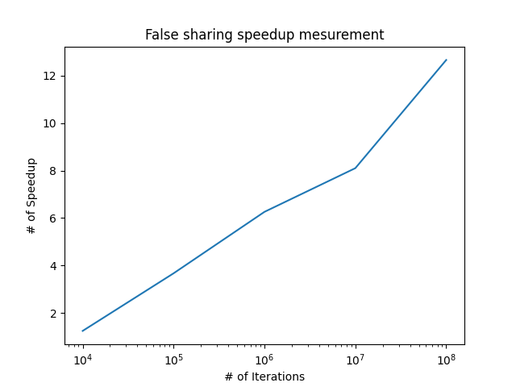

### Summary

---

#### LEC07 Performance Optimization PartII

- About Locality, Communication and Contention

- `Arithmetic intensity = Amount of computation / Amount of communication`

- Inherent communication

  -  Good assignment decisions can reduce inherent communication.

- Artifactual communication

  - Communication results from practical details of system implementation.
  - Like:
    - Program loads one 4-byte float value but entire 64-byte cache line must be transferred from memory(16x more communication than necessary)
    - Program stores 16 consecutive 4-byte float values, so entire 64-byte cache line is loaded from memory and then subsequently stored to memory(2X overhead)

- A new kind of miss:

  - Compulsory Miss / Capacity Miss / Conflict Miss 
  - **Communication Miss**
    - Due to inherent or artifactual communication in parallel system
    - Need some data in other processors

- Techniques for reducing communication

  - Improve temporal locality by changing traversal order(e.g. Matrix Multiply)

  - Improve temporal locality by fusing loops

  - ```cpp
    // Arithmetic intensity: 1/3 <- 2 loads and 1 store per math op
    void add(int n, float* A, float* B, float* C) {
        for (int i=0; i<n; i++)
            C[i] = A[i] + B[i];
    } 
    // Arithmetic intensity: 1/3 <- 2 loads and 1 store per math op
    void mul(int n, float* A, float* B, float* C) {
        for (int i=0; i<n; i++)
            C[i] = A[i] * B[i];
    } 
    
    float* A, *B, *C, *D, *E, *tmp1, *tmp2;
    
    // Overall arithmetic intensity: 1/3
    add(n, A, B, tmp1);
    mul(n, tmp1, C, tmp2);
    add(n, tmp2, D, E);
    ```

  - ```cpp
    // Arithmetic intensity: 3/5 <- 4 loads and 1 store per 3 math ops
    void fused(int n, float* A, float* B, float* C, float* D, float* E) {
        for (int i=0; i<n; i++)
            E[i] = D[i] + (A[i] + B[i]) * C[i];
    }
    ```

  - Reducing artifactual comm: blocked data layout

- Contention

  - fine-grained lock

- **Summary of improving program performance**
  - 
  - identify and exploit locality: communicate less
  - reduce overhead(fewer, larger messages)
  - reduce contention
  - maximize overlap of communication and processing(hide latency)


#### LEC08 Parallel Programming Case Studies

- An example of batching can be found at CS61C LAB07. 
  - get a maximum speedup 20x.
- Generally, algorithms in class is not important.
- Key issues when discussing the applications
  - How to balance the work?
    - how to assignment the work
  - How to exploit locality inherent in the problem?
    - batch
    - data layout
  - What synchronization is necessary?
    - reduce communication
    - reduce contention

#### LEC 09 Workload-Driven Performance Evaluation

-  Understand scaling: size matters!

-  There can be complex interactions between the size of the problem and the size of the parallel computer.

- Evaluating a machine with a fixed problem size can be problematic

  - too small a problem

    - parallelism overhead dominates parallelism benifits
    - problem size may be appropriate for small machines, but inappropriate for large ones

  - too large a problem

    - Key working set may not fit in small machine (cause thrashing to disk)
    - When problem working set fits in a large machine but not a small one, super-linear speedups can occur. (e.g. In a single core computer, a working set exceeds the size of the cache. But with 8 cores, the working set can be contained by caches, which enables a unbelievable speedup.)
  
- Scaling constraints
  
  -  problem constrained scaling - same problem, mesuring the execute time. (e.g. our assignments)
  -  memory constrained scaling - without overflowing main memory 
  -  time constrained scaling - same amount of time `speedup = work done by P processors / work done by 1 processor`
  
- Performance improvement due to parallelism is measured by speedup.
- But speedup metrics **take different forms for different scaling models**.
- Behavior of a parallel program depends significantly on **the scaling properties of the problem** and also the machine.
- Establishing high watermarks.
  
  -  Add "math"  -- If execution time doesn't change, memory bandwidth may be limited.
  -  Remove all math, but load same data.
  -  Remove all atomic operations or locks. -- Extablish an upper bound on benefit of reducing sync overhead
  
- Use profilers/performance monitoring tools(e.g. perf)

- Summary of mesuring the performance of the parallelism

  -  Consider the size of problem.
  
  -  Consider the application and so the type of contraintes.
  
  -  Consider the machine parameter.
  
  -  It's quite hard because there are many factors to be considered.
  
  
  
#### LEC10 Snooping-Based Cache Coherence 

- I'm curious about the behavior of the cache under multi-processors for a long time. A very good chance!

- Something should recall. 
  - Cache behavior: write back/write-allocate and write through/write no allocate
  - Cache line format: dirty bit/tag/index <- n-way associativity
- **Cache coherence problem**
  - Multiple versions of a data will certainly introduce a coherence problem.
  - Definition of coherence **(Similiar to Zookeeper)**
    1. Memory ops issued by anyone processor occur in the order issued by that processor.
    2. The value return by a read is the value written by the last write to the location.
- Snooping cache-coherence schemes
  - main idea: all coherence-related activity is **broadcast** to all processors.
  - Write-through is easy to handle with.

- Write-back: Introduce the concept of the ownership! (RUST)
  - 
  - MSI write-back invalidation protocol
  - 
  - shortcoming: MSI requires two interconnect transactions for the common case of reading an address, then writing to it. **(A bus signal results in a transaction.)**
    - Transaction 1: BusRd to move from I to S state
    - Transaction 2: BusRdX to move from S to M state
    - This ineffiency exists even if application has no sharing at all.(most cases)

  - MESI !
  - Add state E("Exclusive clean").
    - Line has not been modified, but only this cache has a copy of this line.
    - Upgrade from E to M needs not a transaction.
  - 
- Who should supply data on a cache miss when line is in the E or S state of another cache?
  - Other cache: more complex, but reduce both latency of data access and memory bandwidth. (Which cache)
  - Memory: contrary to the above one
  - Introduce new strategy
    - MESIF
      - Like MESI, but one cache holds shared line in F state rather than S(F="Forward")
      - Cache with line in F state services miss.
      - Used by Intel processor
    - MOESI
      - In MESI, transition from M to S requires flush to memory
      - Instead transition from M to O(O="Owned but not exclusive") and do not flush to memory. Other caches remain in S state
      - Data in memory is stale, so cache with line in O state service the cache miss. 
- Invalidate vs. update-based protocol
  - Updates are overhead if
    - Data just sits in caches(and is never read by another processor again)
    - Application performs many writes before the next read.

  - **Current AMD and Intel implementations of cache coherence are invalidation based.**

- Multi-level cache hierarchies
  - The inclusion can't be hold automatically.
  - 
  - Need some more bits in a the L2 cache line, like "in L1" bit and "modified-but-stale" bit.
  - L2 can issue a signal to modify L1 if needed.
- False sharing
  - [programmatically-get-the-cache-line-size](https://stackoverflow.com/questions/794632/programmatically-get-the-cache-line-size)
  - In my computer, the cache line size is 64 bytes.
  - [A simple experiment](Ref/false_sharing/false_sharing.cpp)
  - Result:
  - 

- **Summary of cache**
  - 
  - Generally, the strategy is optimized due to some specific applications like MOESI.
  - The strategy is expressed as a DFA.
  - Need to spend time understanding it.


​     

​    

​     

